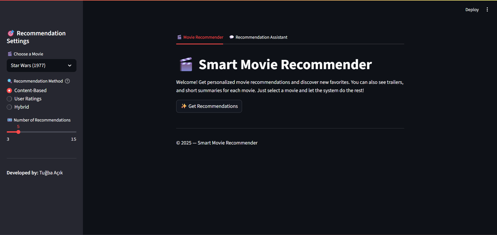
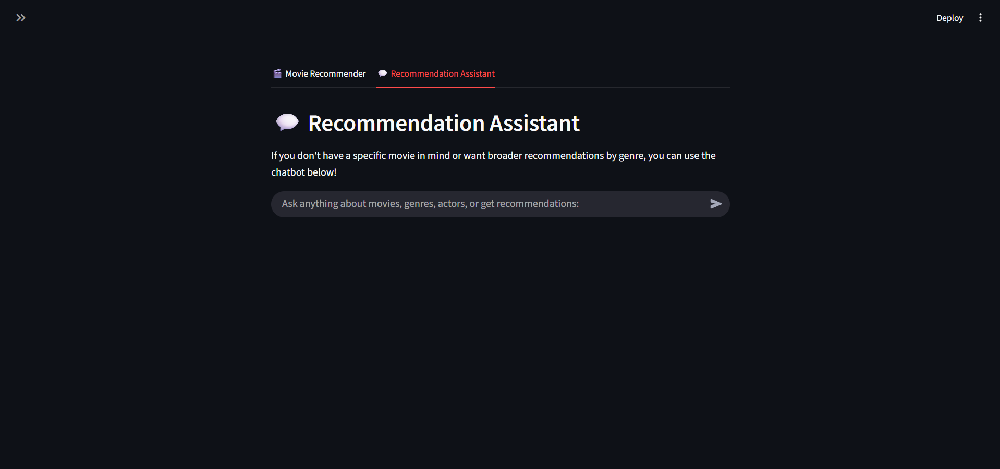

# 🎬 Smart Movie Recommender & Gemini-Powered Chat Assistant

An intelligent, hybrid movie recommendation system with a conversational AI assistant powered by **Google Gemini**.  
This application allows users to explore personalized movie recommendations, view trailers, get AI-generated summaries, and interact with a natural language chatbot.

---

## 🔍 Overview

**Smart Movie Recommender** combines collaborative filtering, content-based methods, and Large Language Models (LLMs) to deliver accurate and interactive movie suggestions. It’s built with **Streamlit** for rapid prototyping and includes:

- 🔄 Hybrid Recommendation System (Content-Based + Collaborative Filtering)
- 🎞️ Plot Summaries & YouTube Trailers via OMDb & Gemini
- 🤖 Gemini Chatbot Assistant with conversational memory
- 📊 Scalable and user-friendly interface

---

## ✨ Features

| Feature                               | Description                                                                 |
|---------------------------------------|-----------------------------------------------------------------------------|
| 🔗 Hybrid Recommender                 | Combines content similarity with user ratings for more reliable results    |
| 🧠 Gemini Integration                 | Leverages Gemini 1.5 for film plot generation and chatbot interaction       |
| 🎬 Rating & Trailer Display           | Integrates with OMDb and YouTube search for a rich visual experience       |
| 💬 Conversational Chat Assistant     | Ask for recommendations, genres, or film trivia in natural language        |
| 🎯 Structured Summaries              | Provides clean, spoiler-free, AI-written plot summaries                    |

---

## 🧰 Tech Stack

- **Python 3.10+**
- **Streamlit** – Frontend interface
- **Scikit-learn** – Content-based recommendation
- **Pandas** – Data manipulation
- **Google Gemini API** – Generative AI assistant
- **OMDb API** – Movie metadata and posters
- **MovieLens 100k** – Ratings dataset

---

## 📦 Installation

### 1. Clone the Repository

```bash
git clone https://github.com/tugbaacik/smart-movie-recommender.git
cd smart-movie-recommender
```

### 2. Set Up a Virtual Environment (Optional but Recommended)

```bash
python -m venv venv
source venv/bin/activate      # On Windows: venv\Scripts\activate
```

### 3. Install Dependencies

```bash
pip install -r requirements.txt
```

### 4. Set Up API Keys

Create a `.env` file in the root directory:

```dotenv
GEMINI_API_KEY=your_gemini_api_key
OMDB_API_KEY=your_omdb_api_key
```

### 5. Launch the App

```bash
streamlit run interface.py
```

---

## 🧠 Application Structure

```
smart-movie-recommender/
│
├── data/
│   └── ml-100k/                   # MovieLens dataset
│
├── recommender/
│   ├── content_based.py           # TF-IDF vectorizer logic
│   ├── ratings_analysis.py        # Collaborative filtering
│   └── hybrid_recommender.py      # Combines both strategies
│
├── interface.py                   # Streamlit-based frontend
├── .env                           # API keys 
├── requirements.txt
└── README.md
```

---

## 🖼️ Screenshots

| Movie Recommender | Gemini Chat Assistant |
|-------------------|-----------------------|
|  |  |

---


